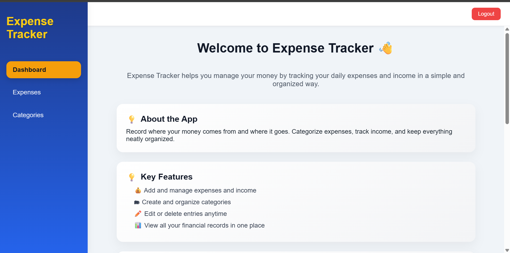
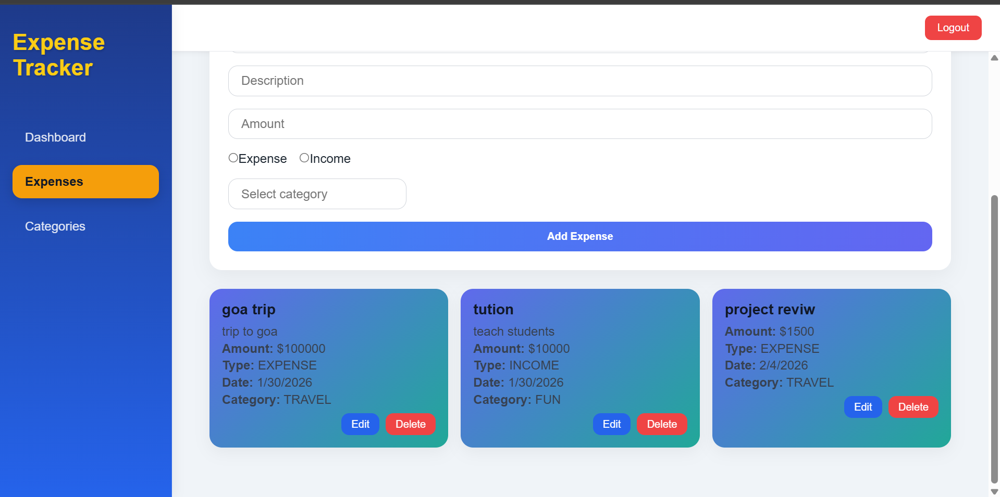
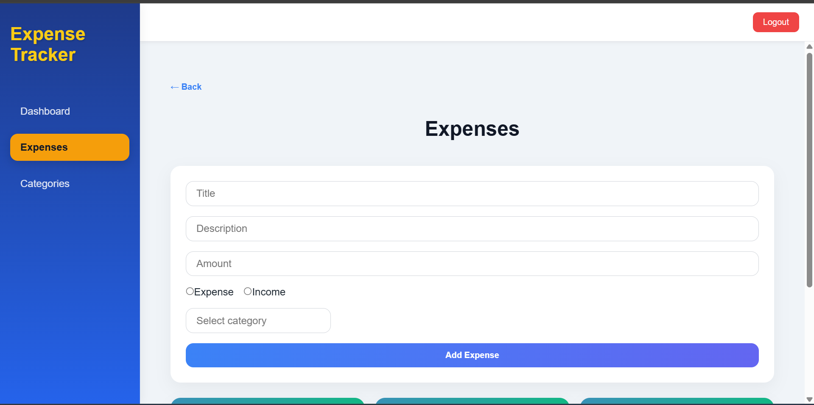
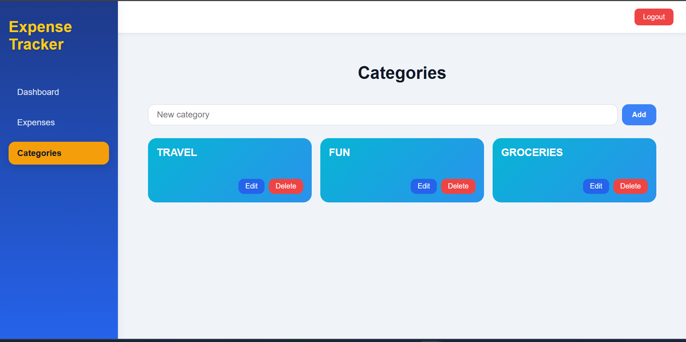

# 💸 Expense Tracker Frontend

A modern **React.js frontend** for an Expense Tracker application, featuring a **dashboard**, **expense management**, **categories**, **authentication**, and **admin management**. Built with **Vite**, **React Hooks**, and modern CSS design patterns, including **responsive cards** and an aesthetic **dashboard layout**.

---

## **Table of Contents**

- [Demo](#demo)  
- [Features](#features)  
- [Project Structure](#project-structure)  
- [Technologies](#technologies)  
- [Getting Started](#getting-started)  
- [Available Scripts](#available-scripts)  
- [License](#license)  

---

## **Demo**

Screenshots of the application:

  
  
  
  
  
  

---

## **Features**

### **User Features**
- **Dashboard**: Overview of expenses and categories.  
- **Expense Management**:  
  - Add, edit, delete expenses  
  - Inline editing on expense cards  
  - Category selection with searchable dropdown  
- **Categories**: View and manage personal expense categories.  
- **Authentication**: Login, register, and logout.  
- **Responsive Design**: Works on desktop and mobile devices.  
- **Modern UI**: Cards, gradients, shadows, hover effects, and badges.  

### **Admin Features**
- **Admin Dashboard**: Overview of system data (users, expenses, categories).  
- **User Management**:  
  - View all users  
  - Update user roles  
  - Delete users  
- **Expense Management**:  
  - View, update, and delete any user’s expense  
- **Category Management**:  
  - View, update, and delete categories  
- **Role-Based Access Control**: Only accessible via `/admin` routes.  

---

## **Project Structure**

```text
expenseTrackerFrontend/
├── public
│   └── vite.svg
├── src
│   ├── assets
│   │   ├── images
│   │   │   ├── home.png
│   │   │   └── home1.png
│   │   └── react.svg
│   ├── features
│   │   ├── admin
│   │   │   ├── pages
│   │   │   │   ├── AdminDashboard.jsx
│   │   │   │   ├── AdminDashboardLayout.jsx
│   │   │   │   ├── CategoriesList.jsx
│   │   │   │   ├── ExpensesList.jsx
│   │   │   │   └── UsersList.jsx
│   │   │   ├── styles
│   │   │   │   ├── categoriesList.css
│   │   │   │   ├── dashboard.css
│   │   │   │   ├── expenseList.css
│   │   │   │   └── usersList.css
│   │   │   └── adminService.js
│   │   ├── auth
│   │   │   ├── pages
│   │   │   │   ├── Login.jsx
│   │   │   │   ├── Logout.jsx
│   │   │   │   └── Register.jsx
│   │   │   ├── services
│   │   │   │   ├── authService.js
│   │   │   │   └── registerService.js
│   │   │   └── store
│   │   │       └── authStore.js
│   │   ├── categories
│   │   │   ├── Categories.jsx
│   │   │   ├── categories.css
│   │   │   └── categoryService.js
│   │   ├── dashboard
│   │   │   └── Dashboard.jsx
│   │   └── expenses
│   │       ├── Expenses.jsx
│   │       ├── expenseService.js
│   │       └── expenses.css
│   ├── layouts
│   │   ├── AdminLayout
│   │   │   └── AdminLayout.jsx
│   │   ├── AuthLayout
│   │   │   ├── AuthLayout.css
│   │   │   └── AuthLayout.jsx
│   │   └── DashboardLayout
│   │       ├── DashboardLayout.jsx
│   │       └── dashboard.css
│   ├── routes
│   │   ├── AdminRoutes.jsx
│   │   ├── AppRoutes.jsx
│   │   └── PrivateRoute.jsx
│   ├── services
│   │   └── httpClient.js
│   ├── App.jsx
│   └── main.jsx
├── .gitignore
├── README.md
├── eslint.config.js
├── index.html
├── package-lock.json
├── package.json
└── vite.config.js


## **Technologies**

- **React.js** (Functional Components & Hooks)  
- **Vite** (Fast frontend bundler)  
- **React Router DOM** (Routing)  
- **JavaScript (ES6+)**  
- **CSS / Modern Responsive Design**  
- **Axios / Fetch API** for HTTP requests  


